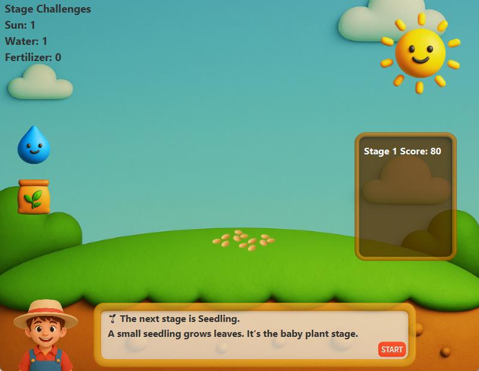

# Plant Growth Simulator

Plant Growth Simulator is a Java-based educational game designed for kids. The game teaches basic plant growth concepts through simple and interactive gameplay.

## Features

- Simple educational game for kids
- Interactive plant growth simulation
- Child-friendly gameplay and interface
- Basic plant growth learning concept
- Runnable JAR file included for easy testing

## Screenshot



## Technologies Used

- Java
- Maven

## How to Run

Download the JAR file from the `release` folder.

Then run this command:

```bash
java -jar release/PlantGrowthSimulator.jar Or double-click the JAR file if Java is installed on your computer.
